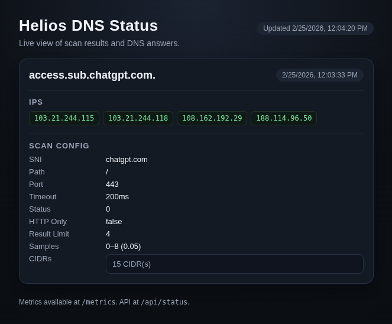

# helios-dns

`helios-dns` is a DNS server that scans CIDR ranges for reachable endpoints, keeps only healthy IPs, and announces those IPs as `A` records for configured domains.

<p align="center">
  
</p>

## How it works

1. For each configured domain, it samples IPs from one or more CIDRs.
2. It runs a health-check program against each sampled IP (TLS/SNI by default, or HTTP-only mode).
3. It keeps up to `result_limit` successful IPs per domain.
4. It serves those IPs from an in-memory DNS server over UDP.
5. It repeats this process every `interval`.

## Features

- UDP DNS server with dynamic `A` record answers.
- Per-domain scan configuration.
- CIDR sampling controls (`sample_min`, `sample_max`, `sample_chance`).
- TLS/SNI and HTTP-based health checks.
- Pluggable scan program (`program`) for custom checks.
- Config reload support via OS signal through the reloader integration.

## Requirements

- Go `1.26+` (for local build/run).
- Or Docker/Compose (for containerized run).

## Quick start

### Run locally

```bash
go run . --config ./config.yaml -v
```

### Run with Docker Compose

```bash
docker compose up -d --build
```

The included `docker-compose.yaml` mounts `./config.local.yaml` into the container as `/config.yaml`.

## Configuration

Example `config.yaml` (see `config.yaml` for inline docs):

```yaml
listen: 127.0.0.1:5353
interval: 10m
domains:
  - domain: "edge.example.com."
    sni: "origin.example.com"
    path: "/healthz"
    cidr:
      - "203.0.113.0/24"
      - "198.51.100.0/24"
    timeout: 250000000
    port: 443
    status_code: 200
    sample_min: 1
    sample_max: 8
    sample_chance: 0.05
    http_only: false
    result_limit: 4
```

### Top-level fields

- `listen`: UDP listen address for DNS server (example: `127.0.0.1:5353`).
- `interval`: scan/update interval.
- `max_workers`: max parallel IP checks across all domains.
- `http_listen`: HTTP server listen address (omit or empty to disable).
- `domains`: list of per-domain scan configs.

### Domain fields

- `domain`: DNS question name key served by this config. Use FQDN format (typically with trailing `.`).
- `cidr`: CIDR list to scan, (defaults to cloudflare's CIDR list).
- `sni`: SNI/Host used in health checks.
- `path`: HTTP path used by `http.get`/`tls.http.get` checks (default: `/`).
- `timeout`: timeout in nanoseconds for checks.
- `port`: target port.
- `status_code`: expected HTTP status (`0` disables HTTP status check).
- `sample_min`: minimum sampled IPs per CIDR (providing value more than `0` causes it to pick first `n` values per CIDR).
- `sample_max`: maximum sampled IPs per CIDR.
- `sample_chance`: sampling probability per candidate IP.
- `http_only`: switch default check program to HTTP-only (or `tcp` only if `status_code` is not provided).
- `program`: optional custom [Mithra](https://github.com/fmotalleb/mithra) VM program template.
- `result_limit`: max accepted IPs kept for this domain.

## CLI flags

```text
-c, --config string       config file path
-l, --listen string       DNS listen address (default 127.0.0.1:5353)
    --interval duration   record refresh interval (default 10m)
    --cidr strings        CIDRs to test (defaults to Cloudflare ranges)
    --http-listen string  listen address of http server (disabled if empty)
-t, --timeout duration    timeout per IP check (default 200ms)
    --sni string          SNI/host for health checks
    --path string         HTTP(S) path for checks (default /)
    --port int            target port (default 443)
    --status int          expected HTTP status (0 disables status check)
    --http-only           use HTTP check instead of TLS+SNI check
    --min-count int       minimum sampled IPs per CIDR
    --max-count int       maximum sampled IPs per CIDR (default 8)
    --chance float        sampling probability (default 0.05)
    --max-workers int     maximum parallel IP checks across all domains (default 50)
-v, --verbose             enable debug logging
```

Notes:

- Config values take precedence over CLI args for matching fields.
- If a domain omits `cidr`, it falls back to CLI/global `--cidr` values.

## HTTP endpoints

The HTTP server exposes:

- `/`: status dashboard UI.
- `/api/status`: JSON summary of domains, configs, last update time, and accepted IPs.
- `/metrics`: Prometheus metrics.

## Custom scan program

You can override the default check logic with `program` in each domain entry.

Default behavior:

- TLS connect with SNI.
- Optional HTTP GET check to `path` when `status_code > 0`.

`http_only: true` default behavior:

- TCP connect only by default.
- Optional HTTP GET to `path` when `status_code > 0`.

The `program` field is rendered as a template and can use fields such as:

- `.Port`
- `.SNI`
- `.Path`
- `.Timeout`
- `.StatusCode`

Example:

```mithra
# TCP scan
tcp.connect port={{ .Port }} timeout={{ .Timeout }}

# Http scan
http.get port={{ .Port }} header.host={{ .SNI }} timeout={{ .Timeout }} path={{ .Path }} expect.status={{ .StatusCode }}

# TLS (tls.connect is mandatory)
tls.connect port={{ .Port }} sni={{ .SNI }} timeout={{ .Timeout }}
{{ if gt .StatusCode 0 -}} tls.http.get header.host={{ .SNI }} path={{ .Path }} expect.status={{ .StatusCode }} {{- end -}}
```

## Build

```bash
go build ./...
```

## License

See `LICENSE`.
